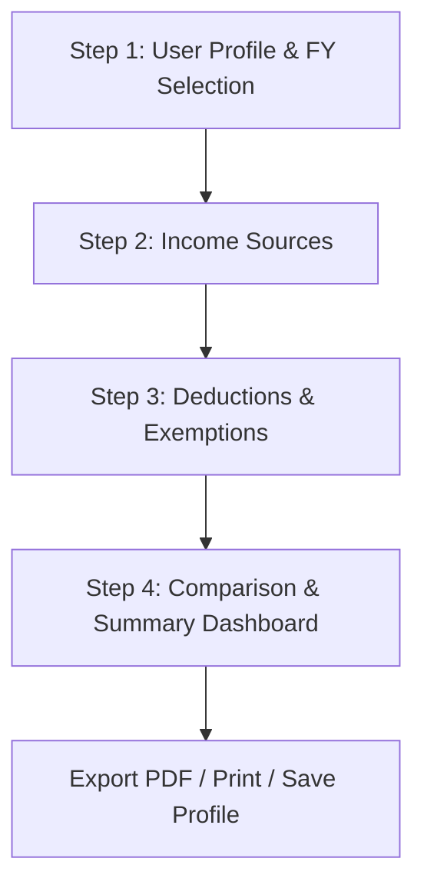
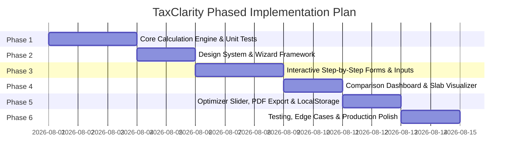

# Product Requirements Document (PRD)
# TaxClarity – Indian Income Tax Calculator & Regime Comparator

**Document Version:** 1.0.0  
**Target Platform:** Web Browser (100% Client-Side / Offline-Capable)  
**Applicable Tax Years:** FY 2024–25 (AY 2025–26) & FY 2025–26 (AY 2026–27)  
**Privacy Guarantee:** Zero Server Calls – All calculations and data stay inside the user's browser.

---

## 1. Executive Summary & Product Vision

### 1.1 Problem Statement
The Indian Income Tax structure has two distinct tax regimes (Old vs. New) with differing tax slabs, standard deductions, rebate limits under Section 87A, and eligible exemptions. Salaried employees and individual taxpayers often struggle to:
- Understand which tax regime gives them the highest take-home pay.
- Accurately calculate complex exemptions (such as HRA, Home Loan Interest under Section 24b, Section 80C, 80D, and 80CCD(1B)).
- Safely compute their taxes without uploading sensitive financial details to third-party servers.

### 1.2 Product Vision
**TaxClarity** is a sleek, privacy-first, step-by-step interactive Indian Income Tax Calculator that guides users through their income sources, eligible deductions, and exemptions. It produces an instant, side-by-side comparison between the Old and New Tax Regimes, clearly highlighting total tax payable, effective tax rate, net take-home pay, and exact tax savings.

---

## 2. Target Audience & User Personas

| Persona | Description | Key Needs |
|---|---|---|
| **Salaried Professional** | IT/Corporate employee with CTC breakdown (Basic, HRA, Special Allowance, EPF). | Needs automated HRA calculation, 80C/80D limit checking, standard deduction auto-apply, and clear comparison of Old vs New regime. |
| **Freelancer / Self-Employed** | Individual with gross professional income, business expenses, and Section 80 deductions. | Needs gross receipts input, presumptive taxation option (44ADA preview) or net business profit, and advance tax awareness. |
| **Senior Citizen (60–79 & 80+)** | Pensioners / Retirees with pension income, interest from FD/savings, and Section 80TTB benefits. | Needs age-based exemption slabs for Old Regime (₹3L / ₹5L basic exemption) and higher 80TTB/80D medical deduction limits. |

---

## 3. Core Tax Logic & Regulatory Specifications

### 3.1 Tax Regimes & Slab Rates (FY 2024–25 / AY 2025–26 & FY 2025–26 updates)

#### A. New Tax Regime (Section 115BAC – Default Regime)
*Standard Deduction for Salaried/Pensioners:* **₹75,000**  
*Section 87A Rebate:* Full rebate if Net Taxable Income $\le$ **₹7,00,000** (Tax payable = ₹0). Marginal relief applies if income slightly exceeds ₹7,00,000.

| Income Slab | Tax Rate |
|---|---|
| Up to ₹3,00,000 | Nil |
| ₹3,00,001 – ₹7,00,000 | 5% |
| ₹7,00,001 – ₹10,00,000 | 10% |
| ₹10,00,001 – ₹12,00,000 | 15% |
| ₹12,00,001 – ₹15,00,000 | 20% |
| Above ₹15,00,000 | 30% |

*Allowed Deductions under New Regime:*
- Standard Deduction: ₹75,000 (Salaried/Pensioners)
- Employer’s contribution to NPS under Section 80CCD(2) (up to 14% of Basic + DA for Govt, up to 14% for Private under updated rules / 10%)
- Deduction for family pension: ₹25,000 or 33.33% of pension (whichever is lower).

---

#### B. Old Tax Regime (Optional Regime)
*Standard Deduction for Salaried/Pensioners:* **₹50,000**  
*Section 87A Rebate:* Full rebate up to ₹12,500 if Net Taxable Income $\le$ **₹5,00,000** (Tax payable = ₹0).

##### 1. Individuals (< 60 years)
| Income Slab | Tax Rate |
|---|---|
| Up to ₹2,50,000 | Nil |
| ₹2,50,001 – ₹5,00,000 | 5% |
| ₹5,00,001 – ₹10,00,000 | 20% |
| Above ₹10,00,000 | 30% |

##### 2. Senior Citizens (Age 60 to 79)
| Income Slab | Tax Rate |
|---|---|
| Up to ₹3,00,000 | Nil |
| ₹3,00,001 – ₹5,00,000 | 5% |
| ₹5,00,001 – ₹10,00,000 | 20% |
| Above ₹10,00,000 | 30% |

##### 3. Super Senior Citizens (Age 80+)
| Income Slab | Tax Rate |
|---|---|
| Up to ₹5,00,000 | Nil |
| ₹5,00,001 – ₹10,00,000 | 20% |
| Above ₹10,00,000 | 30% |

---

### 3.2 Deductions & Exemptions Engine (Old Regime Focus)

1. **House Rent Allowance (HRA) Exemption (Section 10(13A)):**
   Calculated as the lowest of:
   - Actual HRA received
   - Rent paid minus 10% of Basic Salary (+ DA if applicable)
   - 50% of Basic Salary (Metro cities: Delhi, Mumbai, Kolkata, Chennai) OR 40% of Basic Salary (Non-Metro).
2. **Section 80C (Cap: ₹1,50,000):**
   - EPF, VPF, PPF, ELSS Mutual Funds, Life Insurance Premium, NSC, SSY, Tax Saving FDs, Principal repayment on Home Loan, Children Tuition Fees.
3. **Section 80CCD(1B) (Cap: ₹50,000):**
   - Additional voluntary contribution to National Pension System (NPS Tier-1).
4. **Section 80D (Health Insurance Premiums & Preventive Health Checkups):**
   - Self, Spouse & Dependent Children: Up to ₹25,000 (₹50,000 if senior citizen).
   - Parents (< 60 years): Up to ₹25,000.
   - Parents (Senior Citizens 60+): Up to ₹50,000.
   - Max total possible deduction under 80D: ₹1,00,000.
5. **Section 24(b) (Home Loan Interest on Self-Occupied Property):**
   - Max cap: ₹2,00,000 loss from house property against salary income.
6. **Section 80TTA / 80TTB (Interest from Savings/Deposits):**
   - 80TTA (General): Up to ₹10,000 from Savings Bank accounts.
   - 80TTB (Senior Citizens): Up to ₹50,000 from Bank/Post Office Savings & Fixed Deposits.
7. **Section 80E:** Interest paid on Higher Education Loan (No upper cap, allowed for 8 years).
8. **Section 80G:** Eligible donations to charitable institutions (50% or 100% eligibility calculation).

---

### 3.3 Surcharge, Marginal Relief & Health and Education Cess

1. **Surcharge Rates (Both Regimes):**
   - Total Income ₹50 Lakh to ₹1 Crore: 10% of Tax.
   - Total Income ₹1 Crore to ₹2 Crore: 15% of Tax.
   - Total Income ₹2 Crore to ₹5 Crore: 25% of Tax (capped at 25% for New Regime).
   - Total Income > ₹5 Crore: 37% (Old Regime only; New Regime caps maximum surcharge at 25%).
2. **Marginal Relief on Surcharge:**
   - Tax + Surcharge cannot exceed the tax payable on ₹50L / ₹1Cr / ₹2Cr plus the incremental income above the threshold.
3. **Health & Education Cess:**
   - **4%** applied uniformly on the sum of (Income Tax + Surcharge).

---

## 4. User Journey & Step-by-Step UI/UX Flow

The application follows a clean 4-step progressive wizard format, with an optional "Quick Single-Page Mode" toggle for expert users.

### Step 1: User Profile & Financial Year
- **Financial Year Selector:** Default `FY 2024-25 (AY 2025-26)` with option for `FY 2025-26`.
- **Age Category:**
  - Below 60 years (Individual)
  - 60 to 79 years (Senior Citizen)
  - 80 years and above (Super Senior Citizen)
- **Employment Type:** Salaried / Pensioner / Self-Employed / Freelancer.
- **Metro City Resident:** Yes / No (affects HRA calculation).

### Step 2: Income Details
- **Salary Income:**
  - Option A: Enter Gross Annual Salary / CTC with standard deductions automatically handled.
  - Option B (Detailed Breakdown Toggle): Basic Salary, HRA Received, Special Allowance, LTA, Performance Bonus.
- **Income from House Property:**
  - Rental Income received, Municipal taxes paid, or Interest paid on Home Loan (Section 24b).
- **Income from Other Sources:**
  - Savings Bank Interest, Fixed Deposit Interest, Dividend Income, Other taxable receipts.
- **Capital Gains / Business Income (Simplified input):** Short-term & Long-term gains, or net business profits.

### Step 3: Deductions & Tax-Saving Investments
- **HRA Auto-Calculator:** Input actual annual rent paid to automatically compute tax-exempt HRA under Old Regime.
- **Section 80C Helper:** Interactive list (EPF auto-populated if salary breakdown given, PPF, ELSS, Insurance, Tuition fees) with live ₹1,50,000 progress bar.
- **Section 80D Health Insurance:** Visual cards for Self/Family and Parents with age toggle (Senior Citizen).
- **Section 80CCD(1B) NPS:** Additional voluntary NPS up to ₹50,000.
- **Other Deductions:** 80E (Education loan interest), 80G (Donations), 80TTA/80TTB (Interest deduction).
- *Live Hint Badge:* Shows how much deduction is eligible under Old Regime vs. explains that most deductions are disabled under New Regime.

### Step 4: Side-by-Side Comparison & Verdict
- **Recommendation Banner (Verdict Card):**
  - Example: 🎉 *"New Tax Regime saves you ₹28,400 per year!"* or *"Old Tax Regime saves you ₹14,200 thanks to your HRA & Home Loan deductions."*
- **Key Metrics Comparison Grid:**
  - Gross Total Income
  - Total Deductions & Exemptions
  - Net Taxable Income
  - Base Income Tax
  - Section 87A Rebate
  - Surcharge & 4% Health/Education Cess
  - Total Tax Liability
  - Monthly & Annual In-Hand Salary
  - Effective Tax Rate (%)
- **Visual Slab Breakdown:** Interactive collapsible table showing exactly how tax is computed across each slab in both regimes.
- **Interactive "What-If" Optimizer:**
  - Slider: *"How much more do I need to invest in 80C/80D/NPS to make the Old Regime better than the New Regime?"*

---

## 5. Technical Requirements & Architecture

### 5.1 Architecture Principles
1. **100% Client-Side Computation:** Zero backend dependencies. Complete privacy and GDPR/DPDP alignment.
2. **Reactive Engine:** When any input changes, all downstream calculations update in `< 10ms`.
3. **Pure Logic Separation:** Core calculation engine is written as pure, framework-agnostic JavaScript functions with complete unit testability.
4. **Responsive & Mobile-First:** Fluid typography, accessible form controls, clean card layouts, and touch-friendly controls.
5. **No Placeholders:** Real-time feedback, meaningful tooltips, and contextual tax guidance.

### 5.2 Recommended Tech Stack
- **Structure & Framework:** HTML5, Modern Vanilla JS or lightweight React/Vite.
- **Styling:** Modern Vanilla CSS (Custom Design System with CSS variables, Glassmorphism, smooth animations, Dark/Light mode support, Inter/Outfit typography).
- **Visualizations:** Chart.js or lightweight SVG donut/bar charts for tax vs. take-home comparison.
- **Utilities:** `html2pdf.js` or clean `@media print` CSS stylesheet for one-click PDF tax report generation; `localStorage` for saving scenarios locally.

---

## 6. Phased Implementation Roadmap

To allow step-by-step development by an AI coding agent or development team, the project is structured into **6 distinct phases**:

### Phase 1: Core Mathematical Engine & Unit Tests
- [ ] Build `taxEngine.js` containing pure functions:
  - `calculateHRAExemption(basic, hraReceived, rentPaid, isMetro)`
  - `calculateOldRegimeTax(incomeDetails, deductions, ageCategory, financialYear)`
  - `calculateNewRegimeTax(incomeDetails, deductions, financialYear)`
  - `calculateSurchargeAndCess(taxableIncome, baseTax, regime)`
  - `calculateMarginalRelief87A(taxableIncome, regime)`
  - `compareRegimes(incomeDetails, deductions, userProfile)`
- [ ] Write comprehensive test cases covering:
  - Income under ₹7 Lakh (New Regime zero tax via 87A).
  - Income between ₹7L and ₹7.27L (Marginal Relief test under New Regime).
  - High income (> ₹50L, > ₹1Cr, > ₹2Cr) verifying Surcharge & Cess calculation.
  - Senior and Super Senior citizen age slab tests for Old Regime.
  - Full deduction stack (80C, 80D, 80CCD(1B), 24b, HRA) vs default New Regime.

### Phase 2: Design System & Wizard Framework
- [ ] Create `index.html` and `styles.css` with a curated design system:
  - Custom color palette: Deep navy/slate background, emerald green accents for savings, vibrant indigo for primary actions, subtle card borders and glassmorphism.
  - Modern typography: `Inter` / `Outfit` from Google Fonts.
  - Responsive container with step progress indicator (Step 1 $\rightarrow$ 2 $\rightarrow$ 3 $\rightarrow$ 4).
  - Dark / Light mode toggle with persistent state.

### Phase 3: Step-by-Step Input Forms & Dynamic Validation
- [ ] Implement Step 1 (Profile & FY selector, Age group, Employment type).
- [ ] Implement Step 2 (Income form with Quick/Detailed Salary toggle, House Property, Other Sources).
- [ ] Implement Step 3 (Deductions with live 80C cap indicator, 80D age-aware inputs, HRA modal/inline calculator, Section 24b home loan interest).
- [ ] Add smart input formatting (Indian Currency Format `₹ 12,50,000`, number validation, and helpful tooltips for each tax section).

### Phase 4: Comparative Dashboard & Visual Slabs Breakdown
- [ ] Build the Step 4 Results Dashboard:
  - Prominent **Savings Verdict Banner** indicating the winning regime and exact amount saved.
  - Side-by-side comparison table (Old vs New Regime).
  - Interactive Donut / Bar chart showing: [Net Take-Home Pay] vs [Total Tax Paid] vs [Total Deductions].
  - Expandable **Tax Slab Breakdown Accordion** detailing how each rupee is taxed across brackets.

### Phase 5: Interactive Optimizer, PDF Export & Local Storage
- [ ] **Breakeven / What-If Optimizer:** Calculate the exact deduction amount needed to make the Old Regime beat the New Regime.
- [ ] **PDF & Print Styling:** Printable single-page tax summary sheet formatted cleanly with date, breakdown, and regime verdict.
- [ ] **Save / Load Profiles:** Allow users to save multiple scenarios (e.g., "Standard Salary", "With Home Loan", "With Max NPS") to `localStorage`.

### Phase 6: Edge Case Hardening, Accessibility & Polish
- [ ] Cross-browser verification (Chrome, Firefox, Safari, Edge, Mobile Safari).
- [ ] Keyboard navigation and ARIA accessibility labels for screen readers.
- [ ] Micro-animations for step transitions, value counting animations on final results, and instant responsiveness.
- [ ] Final deployment readiness (Single folder / Static host ready: GitHub Pages / Vercel / Netlify).

---

## 7. Test Cases & Verification Matrix

| Test Case ID | Test Scenario | Expected Outcome |
|---|---|---|
| **TC-01** | Gross Salary ₹7,50,000, Salaried, New Regime, No Deductions (FY 24-25) | Taxable = ₹7,50,000 - ₹75,000 (Std Ded) = ₹6,75,000. Full 87A Rebate applied $\rightarrow$ **Tax Payable = ₹0**. |
| **TC-02** | Gross Salary ₹10,00,000, Deductions ₹2,00,000 (80C ₹1.5L + 80D ₹50k) | **New Regime:** Taxable ₹9.25L $\rightarrow$ Tax ₹46,800 (incl. Cess). **Old Regime:** Taxable ₹7.50L $\rightarrow$ Tax ₹65,000 (incl. Cess). **Verdict:** New Regime saves ₹18,200. |
| **TC-03** | Gross Salary ₹15,00,000, Deductions ₹4,50,000 (80C ₹1.5L, 80CCD(1B) ₹50k, 80D ₹50k, HRA ₹1.5L, Std Ded ₹50k) | **Old Regime:** Taxable ₹10.50L $\rightarrow$ Tax ₹1,32,600 (incl. Cess). **New Regime:** Taxable ₹14.25L $\rightarrow$ Tax ₹1,30,000 (incl. Cess). Compares both with precise margin. |
| **TC-04** | Senior Citizen (Age 65), Pension ₹8,00,000, 80TTB ₹40,000, 80D ₹50,000 | Old Regime applies ₹3,00,000 basic exemption threshold and 80TTB deductions correctly. |
| **TC-05** | Total Income ₹55,00,000 (Above ₹50 Lakh Surcharge Threshold) | Computes 10% Surcharge on base tax, checks for Marginal Relief on Surcharge, adds 4% Cess. |

---

## 8. Success Metrics & Acceptance Criteria
1. **Calculation Accuracy:** 100% match with the official Income Tax Department of India online calculator.
2. **Speed & Responsiveness:** Instant calculation updates on value changes (< 16ms, 60fps).
3. **Data Privacy:** 0 outgoing network requests for user financial data.
4. **User Clarity:** Clear, jargon-free explanations on why one regime is recommended over another.
