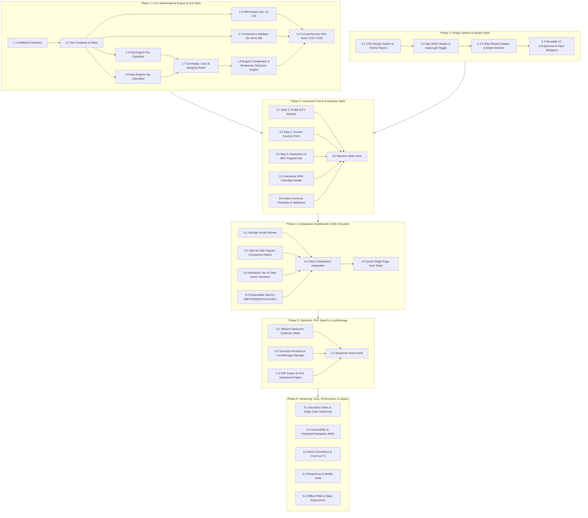

# TaxClarity – Execution Plan & Atomic Task Breakdown

**Document Version:** 1.0.0  
**Based on:** [PRD.md](file:///d:/DS/JC-Uttam-956e/codebasic%20final%2030.06.26/Jupyter%20Notebook/DATA%20SCIENCE/AI%20pro/8.TaxClarity/PRD.md)  
**Target Architecture:** 100% Client-Side Pure JavaScript, HTML5, Vanilla CSS Design System, Chart.js / SVG, and LocalStorage  
**Execution Methodology:** 6 Sequential Phases with Atomic, Test-Driven Tasks & Explicit Dependencies

---

## 1. Project Dependency & Phase Workflow

---

## 2. Phase 1: Core Mathematical Engine & Unit Tests

> **Goal:** Develop pure, framework-agnostic JavaScript calculation modules covering all Indian Income Tax rules (FY 2024-25 & FY 2025-26), Surcharge, Cess, Marginal Relief, and deductions with 100% automated test coverage.

### [x] Task 1.1: Project Directory Structure & Scaffold Setup
- **Target Files:**
  - `index.html` (initial scaffold)
  - `css/styles.css`
  - `js/constants.js`
  - `js/engine/hraCalculator.js`
  - `js/engine/deductionsCalculator.js`
  - `js/engine/oldRegimeCalculator.js`
  - `js/engine/newRegimeCalculator.js`
  - `js/engine/surchargeCalculator.js`
  - `js/engine/taxEngine.js`
  - `js/tests/testSuite.js`
- **Prerequisites:** None
- **Dependencies:** Blocks all subsequent tasks
- **Implementation Steps:**
  1. Create directory tree (`css/`, `js/`, `js/engine/`, `js/components/`, `js/tests/`, `assets/`).
  2. Set up modular ES6 structure with clean import/export syntax or zero-build standalone module architecture.
  3. Create lightweight standalone browser/node test runner in `js/tests/testSuite.js`.
- **Acceptance Criteria:** Directory structure exists and test runner executes cleanly with zero external npm dependencies.

---

### [x] Task 1.2: Tax Constants, Slab Definitions & Configuration
- **Target Files:** `js/constants.js`
- **Prerequisites:** Task 1.1
- **Dependencies:** Blocks Task 1.3 to 1.8
- **Detailed Specifications:**
  - Define slab thresholds and rates for:
    - **New Regime (Section 115BAC):**
      - Standard Deduction: `₹75,000` (FY 24-25 / FY 25-26 salaried/pensioners)
      - Slabs: 0 to 3L (0%), 3L to 7L (5%), 7L to 10L (10%), 10L to 12L (15%), 12L to 15L (20%), >15L (30%)
      - Section 87A Rebate: 100% tax rebate if Net Taxable Income $\le$ `₹7,00,000`
      - Family Pension deduction: $\min(₹25,000, 33.33\% \text{ of pension})$
    - **Old Regime:**
      - Standard Deduction: `₹50,000`
      - Individual (<60 yrs): 0-2.5L (0%), 2.5L-5L (5%), 5L-10L (20%), >10L (30%)
      - Senior Citizen (60-79 yrs): 0-3L (0%), 3L-5L (5%), 5L-10L (20%), >10L (30%)
      - Super Senior Citizen (80+ yrs): 0-5L (0%), 5L-10L (20%), >10L (30%)
      - Section 87A Rebate: Max `₹12,500` if Net Taxable Income $\le$ `₹5,00,000`
    - **Surcharge & Cess Limits:**
      - Surcharge thresholds: 50L (10%), 1Cr (15%), 2Cr (25%), 5Cr (37% Old only, capped at 25% for New)
      - Health & Education Cess: `4%` on Total (Tax + Surcharge)
    - **Deduction Limits:**
      - 80C: `₹1,50,000`
      - 80CCD(1B): `₹50,000`
      - 80D: Self/Family `₹25,000` (Senior: `₹50,000`), Parents `₹25,000` (Senior: `₹50,000`), Max: `₹1,00,000`
      - Section 24(b): Max `₹2,00,000` for Self-Occupied House Property
      - 80TTA: `₹10,000`, 80TTB: `₹50,000`
- **Acceptance Criteria:** All tax constants, slab matrices, and caps match PRD Section 3.1–3.3 exactly and are fully exported as immutable structures.

---

### [x] Task 1.3: House Rent Allowance (HRA) Engine (Section 10(13A))
- **Target Files:** `js/engine/hraCalculator.js`
- **Prerequisites:** Task 1.2
- **Detailed Specifications:**
  - Function signature: `calculateHRAExemption({ basicSalary, dearnessAllowance = 0, hraReceived, rentPaid, isMetro })`
  - Mathematical logic:
    - $\text{Salary for HRA} = \text{basicSalary} + \text{dearnessAllowance}$
    - Condition 1: Actual HRA received
    - Condition 2: $\max(0, \text{rentPaid} - 0.10 \times \text{Salary for HRA})$
    - Condition 3: Metro ? $0.50 \times \text{Salary for HRA}$ : $0.40 \times \text{Salary for HRA}$
    - $\text{Exempt HRA} = \min(\text{Condition 1}, \text{Condition 2}, \text{Condition 3})$
    - $\text{Taxable HRA} = \max(0, \text{hraReceived} - \text{Exempt HRA})$
- **Acceptance Criteria:**
  - Returns `{ exemptHRA, taxableHRA, calculationBreakdown: { condition1, condition2, condition3, chosenCondition } }`.
  - Zero rent or zero HRA correctly returns `0` exemption without NaN errors.

---

### [x] Task 1.4: Section 80 Deductions & Loss on House Property Engine
- **Target Files:** `js/engine/deductionsCalculator.js`
- **Prerequisites:** Task 1.2
- **Detailed Specifications:**
  - Function signature: `calculateDeductions(deductionsInput, userProfile)`
  - Computes and validates caps for:
    - **Section 80C:** Sum of (EPF, PPF, ELSS, Life Insurance, Home Loan Principal, Tuition Fees, Tax Saving FD, NSC, SSY), capped at `₹1,50,000`.
    - **Section 80CCD(1B):** Additional NPS contribution, capped at `₹50,000`.
    - **Section 80CCD(2):** Employer NPS contribution (up to 14% for Govt / 14% or 10% for Private).
    - **Section 80D:**
      - Self & Family: `min(declared, isSelfSenior ? 50000 : 25000)`
      - Parents: `min(declared, isParentsSenior ? 50000 : 25000)`
      - Total 80D: `min(100000, selfDeduction + parentDeduction)`
    - **Section 24(b):** Loss on House Property (Home loan interest for self-occupied property capped at `₹2,00,000`).
    - **Section 80TTA / 80TTB:**
      - If age $\ge 60$: 80TTB eligible up to `₹50,000` (Savings + FD interest).
      - If age $< 60$: 80TTA eligible up to `₹10,000` (Savings bank interest only).
    - **Section 80E:** Higher education loan interest (full deduction, 0 cap).
    - **Section 80G:** Charitable donations (50% or 100% eligible amounts).
- **Acceptance Criteria:** Returns total eligible Old Regime deductions, breakdown per section, and total eligible New Regime deductions (only Std Ded + 80CCD(2)).

---

### [x] Task 1.5: Old Tax Regime Calculation Engine
- **Target Files:** `js/engine/oldRegimeCalculator.js`
- **Prerequisites:** Tasks 1.2, 1.3, 1.4
- **Detailed Specifications:**
  - Function signature: `calculateOldRegimeTax(incomeDetails, deductions, userProfile, financialYear)`
  - Steps:
    1. Calculate Gross Total Income = Salary + House Property Income (or Loss up to ₹2L) + Other Sources + Capital Gains / Business Income.
    2. Apply Standard Deduction (`₹50,000` for Salaried/Pensioners).
    3. Apply HRA Exemption from Task 1.3.
    4. Apply Chapter VI-A deductions (80C, 80D, 80CCD(1B), 80TTA/TTB, 80E, 80G).
    5. Net Taxable Income = $\max(0, \text{Gross Total Income} - \text{Total Deductions})$.
    6. Select slab rate by `ageCategory` (<60, 60-79, 80+).
    7. Calculate Base Tax slab by slab with itemized breakdown.
    8. Section 87A Rebate: If Net Taxable Income $\le ₹5,00,000$, Rebate = $\min(\text{Base Tax}, ₹12,500) \rightarrow$ Tax after rebate = `₹0`.
- **Acceptance Criteria:** Correctly computes base tax and slab breakdown for all age categories with exact rebate handling.

---

### [x] Task 1.6: New Tax Regime Calculation Engine (Section 115BAC)
- **Target Files:** `js/engine/newRegimeCalculator.js`
- **Prerequisites:** Tasks 1.2, 1.4
- **Detailed Specifications:**
  - Function signature: `calculateNewRegimeTax(incomeDetails, deductions, userProfile, financialYear)`
  - Steps:
    1. Gross Total Income = Salary + House Property Income (No Section 24b loss deduction against salary) + Other Sources + Business Income.
    2. Deductions allowed:
       - Standard Deduction: `₹75,000` (Salaried/Pensioners).
       - Employer NPS (Section 80CCD(2)).
       - Family pension deduction if applicable ($\min(₹25,000, 33.33\%)$).
    3. Net Taxable Income = $\max(0, \text{Gross Total Income} - \text{Allowed Deductions})$.
    4. Compute Base Tax across 6 slabs (0%, 5%, 10%, 15%, 20%, 30%).
    5. **Section 87A Full Rebate:** If Net Taxable Income $\le ₹7,00,000 \rightarrow$ Tax payable = `₹0`.
    6. **Marginal Relief under Section 87A (Income between ₹7,00,000 and ₹7,27,777):**
       - If $\text{Net Taxable Income} > ₹7,00,000$:
       - $\text{Excess Income} = \text{Net Taxable Income} - 700000$
       - If $\text{Base Tax} > \text{Excess Income}$, then $\text{Base Tax} = \text{Excess Income}$ (Tax cannot exceed income in excess of ₹7 Lakh).
- **Acceptance Criteria:** Correctly computes New Regime tax, full 87A rebate for income $\le ₹7L$, and marginal relief for income just above ₹7L.

---

### [x] Task 1.7: Surcharge, Surcharge Marginal Relief & Health/Education Cess Module
- **Target Files:** `js/engine/surchargeCalculator.js`
- **Prerequisites:** Tasks 1.5, 1.6
- **Detailed Specifications:**
  - Function signature: `calculateSurchargeAndCess(taxableIncome, taxAfterRebate, regime)`
  - Surcharge Rules:
    - ₹50L to ₹1Cr: 10%
    - ₹1Cr to ₹2Cr: 15%
    - ₹2Cr to ₹5Cr: 25%
    - >₹5Cr: 37% (Old Regime) / 25% (New Regime)
  - **Marginal Relief on Surcharge Calculation:**
    - For threshold $T \in [50\text{L}, 1\text{Cr}, 2\text{Cr}, 5\text{Cr}]$:
    - $\text{Tax at } T = \text{Base tax on income } T + \text{Surcharge at threshold } T$
    - $\text{Max Allowed (Tax + Surcharge)} = \text{Tax at } T + (\text{Taxable Income} - T)$
    - If $\text{Tax} + \text{Surcharge} > \text{Max Allowed}$, reduce surcharge by difference.
  - **Health & Education Cess:**
    - $\text{Cess} = 0.04 \times (\text{Tax after Rebate} + \text{Final Surcharge})$
  - Total Tax Liability = $\text{Tax after Rebate} + \text{Final Surcharge} + \text{Cess}$.
- **Acceptance Criteria:** Accurately calculates surcharge, verifies marginal relief on boundary values (e.g. ₹50.5L, ₹1.01Cr), and applies 4% Cess.

---

### [x] Task 1.8: Master Tax Engine, Regime Comparator & Optimizer Logic
- **Target Files:** `js/engine/taxEngine.js`
- **Prerequisites:** Tasks 1.3, 1.4, 1.5, 1.6, 1.7
- **Detailed Specifications:**
  - Function `compareRegimes(userInput)`:
    - Executes Old and New calculations in parallel.
    - Computes:
      - `taxDifference = Math.abs(oldResult.totalTax - newResult.totalTax)`
      - `recommendedRegime = oldResult.totalTax < newResult.totalTax ? 'OLD' : (newResult.totalTax < oldResult.totalTax ? 'NEW' : 'EQUAL')`
      - `annualSavings = taxDifference`
      - `monthlyTakeHomeOld = (grossIncome - oldResult.totalTax) / 12`
      - `monthlyTakeHomeNew = (grossIncome - newResult.totalTax) / 12`
      - `effectiveRateOld = (oldResult.totalTax / grossIncome) * 100`
      - `effectiveRateNew = (newResult.totalTax / grossIncome) * 100`
  - Function `calculateBreakevenDeductions(userInput)`:
    - Calculates the exact additional Chapter VI-A / HRA deduction required for Old Regime tax to match New Regime tax.
- **Acceptance Criteria:** Returns comprehensive comparative object with winning verdict, take-home delta, and breakeven point.

---

### [x] Task 1.9: Automated Test Suite & PRD Test Cases Verification
- **Target Files:** `js/tests/testSuite.js`
- **Prerequisites:** Task 1.8
- **Detailed Specifications:**
  - Automated tests asserting exact match for:
    - **TC-01:** Gross Salary ₹7,50,000, Salaried, New Regime, No Deductions $\rightarrow$ Taxable ₹6,75,000 $\rightarrow$ Full 87A Rebate $\rightarrow$ **Tax = ₹0**.
    - **TC-02:** Gross Salary ₹10,00,000, Deductions ₹2,00,000 (80C ₹1.5L + 80D ₹50k) $\rightarrow$ New Regime: ₹46,800 vs Old Regime: ₹65,000 $\rightarrow$ **New Regime saves ₹18,200**.
    - **TC-03:** Gross Salary ₹15,00,000, Deductions ₹4,50,000 (80C ₹1.5L, 80CCD(1B) ₹50k, 80D ₹50k, HRA ₹1.5L, Std Ded ₹50k) $\rightarrow$ Old Regime: ₹1,32,600 vs New Regime: ₹1,30,000 $\rightarrow$ **New Regime saves ₹2,600**.
    - **TC-04:** Senior Citizen (Age 65), Pension ₹8,00,000, 80TTB ₹40,000, 80D ₹50,000 $\rightarrow$ Old Regime basic exemption ₹3,00,000 + 80TTB applied correctly.
    - **TC-05:** Total Income ₹55,00,000 $\rightarrow$ 10% Surcharge, Marginal Relief check, 4% Cess.
    - **TC-06 (Marginal Relief 87A):** Gross Salary ₹7,85,000 (New Regime, Taxable ₹7,10,000). Base tax before relief = ₹21,000. Excess over 7L = ₹10,000. Marginal relief caps base tax to ₹10,000 + 4% Cess = ₹10,400.
    - **TC-07 (HRA Exemption):** Basic ₹6,00,000, HRA ₹3,00,000, Rent ₹2,40,000 (Metro) $\rightarrow$ Condition 1: ₹3,00,000, Condition 2: ₹1,80,000, Condition 3: ₹3,00,000 $\rightarrow$ Exempt HRA = ₹1,80,000.
- **Acceptance Criteria:** All test cases pass with 100% assertions green in console and visual test runner.

---

## 3. Phase 2: Design System, UI Tokens & Wizard Shell

> **Goal:** Build a state-of-the-art, responsive, dark/light themed UI framework with custom CSS variables, glassmorphic cards, fluid typography (`Inter` / `Outfit`), and a step wizard container.

### [x] Task 2.1: Custom CSS Design System & Theme Token Architecture
- **Target Files:** `css/styles.css`, `css/variables.css`, `css/components.css`
- **Prerequisites:** Task 1.1
- **Dependencies:** Blocks Task 2.2 to 2.4
- **Detailed Specifications:**
  - CSS Custom Properties (Theme tokens):
    - Dark theme (Default): Deep Slate/Navy `#0B0F19`, Surface Card `#151D2E`, Glass Card `rgba(30, 41, 59, 0.7)`, Border `rgba(255, 255, 255, 0.08)`.
    - Light theme: Canvas `#F8FAFC`, Surface Card `#FFFFFF`, Border `rgba(0, 0, 0, 0.08)`.
    - Accent colors: Emerald Green `#10B981` (Tax Savings / Victory), Vibrant Indigo `#6366F1` (Primary Actions), Amber `#F59E0B` (Alerts/Hints), Rose `#EF4444` (Tax Payable).
  - Typography: Google Fonts `Outfit` (Headings) and `Inter` (Body & Numerical Data) with `font-feature-settings: 'tnum' 1` for tabular aligned numbers.
  - Utility classes: `.glass-card`, `.gradient-text`, `.btn-primary`, `.badge-savings`, `.pill-tab`, `.glow-emerald`.
- **Acceptance Criteria:** Polished CSS tokens configured with zero external CSS frameworks, complete light/dark variables, and glassmorphic styling.

---

### [x] Task 2.2: Application Header, Navigation & Theme Switcher
- **Target Files:** `index.html`, `js/components/themeManager.js`
- **Prerequisites:** Task 2.1
- **Detailed Specifications:**
  - Responsive header featuring:
    - Logo + Brand: "TaxClarity" with shield/calculator badge and tagline *"100% Private Client-Side Tax Comparator"*.
    - Financial Year Indicator Badge (`FY 2024-25 | AY 2025-26`).
    - Quick Mode vs. Step Wizard Toggle switch.
    - Theme Switcher button (Sun / Moon icon) with localStorage persistence (`theme-preference`).
    - Privacy Guarantee Pill (*"Zero Data Sent to Server"* with lock icon).
- **Acceptance Criteria:** Header renders beautifully on all screen widths; theme toggle switches instantly without page flash.

---

### [x] Task 2.3: 4-Step Wizard Stepper & Mode Switcher Shell
- **Target Files:** `index.html`, `js/components/wizardStepper.js`
- **Prerequisites:** Task 2.2
- **Detailed Specifications:**
  - 4-Step Wizard Bar:
    - Step 1: *Profile & FY*
    - Step 2: *Income Sources*
    - Step 3: *Deductions & 80C*
    - Step 4: *Comparison & Verdict*
  - Interactive stepper:
    - Active, Completed (checkmark), and Upcoming step states.
    - Direct click-to-navigate on previously visited steps.
    - Previous (`← Back`) and Next (`Continue →`) action buttons with keyboard shortcut support (Enter / Left / Right arrows).
  - Single-Page Quick View Toggle container that switches between step-by-step slides and an all-in-one dashboard layout.
- **Acceptance Criteria:** Step transitions are smooth with active status indicator and synchronized progress bar percentage (25%, 50%, 75%, 100%).

---

### [x] Task 2.4: Reusable Input Wrappers, Currency Add-ons & Tooltip System
- **Target Files:** `css/components.css`, `js/components/tooltip.js`
- **Prerequisites:** Task 2.1
- **Detailed Specifications:**
  - Currency Input Component:
    - Left prefix `₹`, auto-clearing leading zeroes, right-aligned formatted preview.
    - Quick increment buttons (`+ ₹50k`, `+ ₹1L`, `+ ₹5L`).
  - Contextual Info Tooltip:
    - Floating glassmorphism tooltips explaining tax sections (e.g., *"Section 80CCD(1B): NPS investment over and above 80C limit up to ₹50,000"*).
  - Animated Toggle Switch / Segmented Pill Controls for Binary/Multi options.
- **Acceptance Criteria:** All input fields have accessible labels, formatted currency indicators, responsive touch targets, and hover/focus tooltips.

---

## 3. Phase 3: Step-by-Step Interactive Input Forms & Validation

> **Goal:** Build rich, reactive input views for Profile, Income Sources, Deductions, and the live HRA calculator with instant calculation binding.

### [x] Task 3.1: Step 1 – User Profile & Financial Year Form
- **Target Files:** `js/components/stepProfile.js`, `index.html`
- **Prerequisites:** Tasks 1.8, 2.3
- **Detailed Specifications:**
  - Form Fields:
    - **Financial Year:** Segmented Pill (`FY 2024-25 (AY 2025-26)` [Default] vs `FY 2025-26 (AY 2026-27)`).
    - **Age Category:** Radio cards:
      - 👶 Below 60 Years (Standard)
      - 👴 60 to 79 Years (Senior Citizen - ₹3L Exemption Old Regime)
      - 🧓 80+ Years (Super Senior - ₹5L Exemption Old Regime)
    - **Employment Type:** Salaried / Pensioner / Self-Employed / Freelancer.
      - Auto-toggles standard deduction visibility based on selection.
    - **Metro City Resident:** Yes (50% HRA) / No (40% HRA).
- **Acceptance Criteria:** Profile state updates dynamically, updating dependent deduction limits across other steps.

---

### [x] Task 3.2: Step 2 – Income Sources Module (Quick vs Detailed Mode)
- **Target Files:** `js/components/stepIncome.js`, `index.html`
- **Prerequisites:** Task 3.1
- **Detailed Specifications:**
  - **Salary Income Container:**
    - Toggle: `Quick Gross CTC` vs `Detailed CTC Breakdown`.
    - Quick mode: Single input for Gross Annual Salary.
    - Detailed mode: Basic Salary, HRA Received, Special Allowance, LTA, Performance Bonus / Other Allowances (auto-sums to Gross Salary).
  - **House Property Income / Loss Container:**
    - Self-Occupied vs Let-Out property selector.
    - Home Loan Interest paid under Section 24(b) (negative income input).
    - Annual Rent received & municipal taxes paid (for Let-Out).
  - **Income from Other Sources:**
    - Savings Bank Account Interest (syncs with 80TTA/80TTB).
    - Fixed Deposit / Recurring Deposit Interest.
    - Dividend & Other Taxable Income.
  - **Capital Gains / Business Profits (Simplified):** Short-term / Long-term gains and Net Freelance/Business profits.
- **Acceptance Criteria:** Real-time calculation of Gross Total Income with seamless toggling between quick and detailed salary breakdown.

---

### [x] Task 3.3: Step 3 – Deductions & Tax-Saving Investments Form
- **Target Files:** `js/components/stepDeductions.js`, `index.html`
- **Prerequisites:** Task 3.2
- **Detailed Specifications:**
  - **Section 80C Hub:**
    - Individual item inputs: EPF (auto-calculated from Basic if detailed salary provided), PPF, ELSS, Life Insurance, Home Loan Principal, Tuition Fees, Tax FD, NSC/SSY.
    - Live **₹1,50,000 Progress Bar** with dynamic fill color, showing amount used and remaining capacity.
  - **Section 80D Health Insurance:**
    - Card A: Self, Spouse & Dependent Children (₹25,000 max / ₹50,000 if senior).
    - Card B: Parents with Senior Citizen toggle (₹25,000 / ₹50,000 max).
    - Preventive Health Checkup included (₹5,000 sub-limit within 80D).
  - **Section 80CCD(1B) NPS:** Additional voluntary NPS input (capped at ₹50,000).
  - **Section 80CCD(2):** Employer NPS contribution (auto-percentage calculator).
  - **Other Deductions:** Section 80E (Education loan), Section 80G (Donations), Section 80TTA / 80TTB (auto-filled from interest income).
  - **Regime Applicability Badges:** Visual tag highlighting *"Deductions apply to Old Regime only; New Regime uses Flat ₹75,000 Standard Deduction"*.
- **Acceptance Criteria:** All deductions strictly respect statutory caps and update total deduction sum in real time.

---

### [x] Task 3.4: Interactive HRA Exemption Calculator Modal & Auto-Populator
- **Target Files:** `js/components/hraModal.js`, `index.html`
- **Prerequisites:** Tasks 1.3, 3.3
- **Detailed Specifications:**
  - Inline / Modal HRA Helper:
    - Input: Annual Rent Paid.
    - Pulls Basic Salary, HRA Received, and Metro Status from previous steps.
    - Displays real-time three-rule comparison:
      1. Actual HRA received: `₹ X`
      2. Rent paid $- 10\%$ Basic: `₹ Y`
      3. $50\%$ or $40\%$ Basic: `₹ Z`
    - Highlights winning (minimum) rule as the Exempt HRA and computes Taxable HRA.
    - One-click button *"Apply Exempt HRA (₹ ...)"* to automatically transfer exemption to tax engine.
- **Acceptance Criteria:** Renders detailed math step-by-step; accurately injects computed exemption into deduction engine.

---

### [x] Task 3.5: Indian Currency Formatter & Dynamic Input Sanitization
- **Target Files:** `js/utils/formatters.js`, `js/utils/validators.js`
- **Prerequisites:** Task 2.4
- **Detailed Specifications:**
  - `formatINR(amount, includeSymbol = true)`: Formats numbers into standard Indian numbering system (`₹ 15,00,000` instead of `1,500,000`).
  - `parseINR(formattedString)`: Robust string to numeric sanitizer stripping symbols, spaces, and non-numeric characters.
  - Number to Words helper: Displays words in Indian notation on hover/focus (e.g., *"₹ 12,50,000 = Twelve Lakh Fifty Thousand Rupees"*).
  - Real-time keystroke formatting for numeric inputs without cursor jumping bugs.
- **Acceptance Criteria:** All numeric inputs seamlessly format to INR standard and parse correctly without NaN or cursor glitches.

---

### [x] Task 3.6: State Management & Reactive Calculation Event Bus
- **Target Files:** `js/state/store.js`
- **Prerequisites:** Tasks 1.8, 3.1, 3.2, 3.3, 3.5
- **Detailed Specifications:**
  - Centralized reactive state store holding:
    - `profile`: `{ financialYear, ageCategory, employmentType, isMetro }`
    - `income`: `{ salaryMode, grossSalary, basic, hra, specialAllowance, lta, bonus, housePropertyLoss, otherInterest, capitalGains }`
    - `deductions`: `{ sec80C: {...}, sec80D: {...}, sec80CCD1B, sec80CCD2, sec24b, sec80E, sec80G, sec80TTA, sec80TTB, customHRA }`
    - `results`: `{ oldRegime, newRegime, comparison, breakeven }`
  - Event listener triggers calculation update on every input change in `< 10ms`.
  - Subscribers notify all registered UI components to re-render dirty DOM elements.
- **Acceptance Criteria:** State is single source of truth; any input modification updates comparison outputs instantly.

---

## 4. Phase 4: Comparative Dashboard, Visual Analytics & Slab Breakdown

> **Goal:** Develop the Step 4 Results Dashboard featuring the regime verdict banner, side-by-side comparison table, interactive visual charts, and collapsible slab-by-slab tax breakdown.

### [x] Task 4.1: Savings Verdict & Recommendation Hero Banner
- **Target Files:** `js/components/verdictBanner.js`, `index.html`
- **Prerequisites:** Task 3.6
- **Detailed Specifications:**
  - Visual Hero Card:
    - 🎉 Highlight Winning Regime: *"New Tax Regime saves you ₹48,200 per year!"* or *"Old Tax Regime saves you ₹24,000 thanks to your HRA & Home Loan!"*.
    - Monthly take-home difference highlight (*"₹4,016 extra in hand every month"*).
    - Status badge: `✨ RECOMMENDED REGIME` on the winning column.
    - Celebration confetti micro-animation triggered if savings $> ₹25,000$.
- **Acceptance Criteria:** Clear, eye-catching banner highlighting winning regime and exact savings in both annual and monthly terms.

---

### [x] Task 4.2: Side-by-Side Regime Comparison Matrix
- **Target Files:** `js/components/comparisonTable.js`, `index.html`
- **Prerequisites:** Task 4.1
- **Detailed Specifications:**
  - Side-by-side comparison grid with columns `Tax Metric`, `Old Tax Regime`, `New Tax Regime`, and `Delta`:
    1. **Gross Total Income**
    2. **Standard Deduction** (`₹50,000` vs `₹75,000`)
    3. **Chapter VI-A & Other Exemptions** (`₹ X` vs `₹ 0` / 80CCD(2))
    4. **Total Deductions**
    5. **Net Taxable Income**
    6. **Tax Computed on Slabs**
    7. **Section 87A Tax Rebate** (Green minus indicator)
    8. **Surcharge (if applicable)**
    9. **Health & Education Cess (4%)**
    10. **Total Tax Payable** (Highlighted in bold)
    11. **Effective Tax Rate (%)**
    12. **Annual In-Hand Income**
    13. **Monthly Take-Home Pay**
- **Acceptance Criteria:** Tabular metrics align perfectly with active regime calculations and show clear green/red delta badges.

---

### [x] Task 4.3: Interactive Visual Charts (Take-Home vs Tax vs Deductions)
- **Target Files:** `js/components/charts.js`, `index.html`
- **Prerequisites:** Task 4.2
- **Detailed Specifications:**
  - Lightweight visualization (Chart.js or custom SVG Donut & Stacked Bar):
    - **Chart 1: Income Allocation Donut** (Take-Home Pay vs Tax Paid vs Tax-Saved via Deductions).
    - **Chart 2: Old vs New Regime Comparison Bar** comparing Total Tax Liability side-by-side.
  - Interactive hover tooltips showing rupee amounts and percentages.
  - Smooth animation on value updates.
- **Acceptance Criteria:** Charts render cleanly across screen sizes with smooth re-draw transitions on state change.

---

### [x] Task 4.4: Expandable Slab-by-Slab Tax Breakdown Accordion
- **Target Files:** `js/components/slabAccordion.js`, `index.html`
- **Prerequisites:** Task 4.2
- **Detailed Specifications:**
  - Collapsible Accordion: *"See Detailed Tax Slab Breakdown"*.
  - Displays dual slab tables:
    - **Old Regime Slab Table:** Slabs (0%, 5%, 20%, 30%), Taxable in bracket, Tax amount for each bracket.
    - **New Regime Slab Table:** Slabs (0%, 5%, 10%, 15%, 20%, 30%), Taxable in bracket, Tax amount for each bracket.
  - Explanatory footnote detailing how Section 87A rebate and 4% Cess were applied on the subtotal.
- **Acceptance Criteria:** Users can verify the exact arithmetic behind their tax liability bracket-by-bracket.

---

### [x] Task 4.5: Step 4 Dashboard Integration & Results Synchronizer
- **Target Files:** `js/components/stepResults.js`, `index.html`
- **Prerequisites:** Tasks 4.1, 4.2, 4.3, 4.4
- **Detailed Specifications:**
  - Assemble Verdict Banner, Comparison Table, Charts, and Slab Accordion into a cohesive Step 4 View.
  - Add quick action toolbar:
    - 📥 Download PDF Summary
    - 🖨️ Print Tax Breakdown
    - 💾 Save Scenario
    - 🔄 Reset / Start Over
- **Acceptance Criteria:** Step 4 displays full results dashboard immediately upon entering the step.

---

### [x] Task 4.6: Quick Single-Page View Mode
- **Target Files:** `js/components/quickView.js`, `index.html`
- **Prerequisites:** Task 4.5
- **Detailed Specifications:**
  - Implement two-column side-by-side layout for expert users:
    - Left Column: Compact accordion of all inputs (Profile, Income, Deductions).
    - Right Column: Sticky live comparison summary with verdict and chart.
  - Toggle smoothly switches between Wizard mode and Quick View mode without losing any entered data.
- **Acceptance Criteria:** Quick Mode functions flawlessly on desktop screens with live instant recalculation.

---

## 5. Phase 5: Interactive Optimizer, PDF Export & Local Persistence

> **Goal:** Implement the "What-If" Breakeven Tax-Saving Optimizer, multi-scenario saving to LocalStorage, and a dedicated PDF / Print summary generator.

### [x] Task 5.1: "What-If" Breakeven Tax-Saving Optimizer Slider
- **Target Files:** `js/components/optimizerSlider.js`, `index.html`
- **Prerequisites:** Tasks 1.8, 4.5
- **Detailed Specifications:**
  - Breakeven Engine Integration:
    - If New Regime is winning: Computes *"You need ₹X more in Old Regime deductions (80C/80D/NPS/HRA) to make the Old Regime cheaper."*
    - If Old Regime is winning: Computes *"Old Regime is already saving you ₹Y."*
  - Interactive "What-If" Slider:
    - User can drag slider to simulate adding `₹0` to `₹2,50,000` in extra deductions.
    - Live gauge shows the breakeven crossover point where Old Regime becomes more profitable.
    - Suggestions panel: Recommends specific avenues (e.g. *"Invest ₹50,000 in NPS 80CCD(1B) to save ₹15,600 in tax"*).
- **Acceptance Criteria:** Optimizer provides mathematically accurate breakeven points with interactive slider updates.

---

### [x] Task 5.2: Multi-Scenario LocalStorage Manager
- **Target Files:** `js/components/scenarioManager.js`, `index.html`
- **Prerequisites:** Task 4.5
- **Detailed Specifications:**
  - Scenarios Drawer / Modal:
    - Save current input state with custom title (e.g., *"Baseline CTC"*, *"With ₹2L Home Loan"*, *"Max NPS Scenario"*).
    - List of saved scenarios with timestamp, regime verdict, and annual savings.
    - Actions: `Load`, `Rename`, `Duplicate`, `Delete`, `Export JSON`, `Import JSON`.
  - Privacy Guarantee banner: All scenarios stored exclusively in browser `window.localStorage`.
- **Acceptance Criteria:** Scenarios persist across browser reloads; loading a scenario repopulates all inputs and recalculates results.

---

### [x] Task 5.3: PDF Report Generation & Clean Print Stylesheet
- **Target Files:** `css/print.css`, `js/utils/pdfGenerator.js`, `index.html`
- **Prerequisites:** Task 4.5
- **Detailed Specifications:**
  - `@media print` dedicated CSS styling:
    - Hides navigation bars, theme toggles, and buttons.
    - Formats clean, executive 1-page / 2-page A4 tax report.
    - Contains TaxClarity header, Date & Timestamp, User Profile, Gross Income Breakdown, Deductions Summary, Side-by-Side Comparison Table, and Final Recommendation Verdict.
  - Client-side PDF Download integration (via `html2pdf.js` or `window.print()` clean fallback).
- **Acceptance Criteria:** PDF/Print output is crystal clear, perfectly paginated on A4, and includes all necessary tax audit figures.

---

### [x] Task 5.4: Privacy-Safe Shareable URL State Serializer
- **Target Files:** `js/utils/urlSerializer.js`
- **Prerequisites:** Task 4.5
- **Detailed Specifications:**
  - Encode current input state into URL hash parameters using LZ-string / Base64 encoding.
  - Generate shareable link (*"Copy Link with My Calculation"*).
  - When opening URL with hash, auto-populate inputs safely with client-side sanitization.
  - No server requests involved; 100% client-side URL parsing.
- **Acceptance Criteria:** Users can share links or bookmark their calculations without sending data to any external server.

---

## 6. Phase 6: Edge Case Hardening, Accessibility, Cross-Browser & Polish

> **Goal:** Conduct end-to-end quality assurance, harden edge cases (zero income, slab boundaries, extreme incomes), enforce WCAG 2.1 AA accessibility, add micro-interactions, and prepare static production deployment.

### [x] Task 6.1: Edge Cases & Boundary Value Hardening
- **Target Files:** `js/engine/taxEngine.js`, `js/tests/testSuite.js`
- **Prerequisites:** Tasks 1.9, 5.1
- **Detailed Specifications:**
  - Verify and harden:
    - Zero income / negative house property loss exceeding income.
    - Exact slab boundary incomes: `₹2,50,000`, `₹3,00,000`, `₹5,00,000`, `₹7,00,000`, `₹10,00,000`, `₹12,00,000`, `₹15,00,000`.
    - 87A Marginal relief boundary under New Regime: `₹7,00,001` to `₹7,27,777`.
    - Surcharge thresholds: `₹50,00,000`, `₹50,00,001`, `₹1,00,00,000`, `₹2,00,00,000`, `₹5,00,00,000`.
    - Deductions exceeding gross income (Net Taxable Income cannot be negative).
- **Acceptance Criteria:** Zero calculation crashes, zero NaN outputs, and 100% precision on all edge cases.

---

### [x] Task 6.2: Accessibility (a11y), Screen Readers & Keyboard Navigation
- **Target Files:** `index.html`, `css/styles.css`
- **Prerequisites:** Tasks 2.3, 4.5
- **Detailed Specifications:**
  - Full keyboard accessibility: Tab navigation, Enter/Space activation, Escape to close modals/tooltips.
  - Semantic HTML5 structure (`<main>`, `<section>`, `<nav>`, `<header>`, `<article>`).
  - ARIA attributes: `aria-expanded`, `aria-controls`, `aria-live="polite"` for calculation updates, and descriptive `aria-label` for all icon buttons.
  - WCAG 2.1 AA compliant color contrast ratios in both Dark and Light themes.
- **Acceptance Criteria:** Lighthouse Accessibility score $\ge 98/100$; full keyboard navigation verified.

---

### [x] Task 6.3: UI Polish, Smooth Micro-Animations & Count-up FX
- **Target Files:** `css/animations.css`, `js/utils/countUp.js`
- **Prerequisites:** Task 4.5
- **Detailed Specifications:**
  - Add smooth numerical count-up effect on final tax numbers and savings amount (`0` to `₹XX,XXX` over 600ms).
  - Step transition slide animations (fade-in & slide-up).
  - Pulse / Glow animations on recommended regime card.
  - Smooth hover states on buttons, cards, and input fields.
- **Acceptance Criteria:** UI feels ultra-smooth, responsive, and modern with 60fps animations.

---

### [x] Task 6.4: Cross-Browser & Mobile Responsiveness Audit
- **Target Files:** `css/styles.css`, `css/responsive.css`
- **Prerequisites:** Tasks 6.1, 6.3
- **Detailed Specifications:**
  - Test across viewports:
    - Mobile (360px – 480px)
    - Tablet (768px – 1024px)
    - Desktop (1200px+)
  - Validate touch-friendly controls (minimum 44px touch targets).
  - Cross-browser verification: Chrome, Edge, Firefox, Safari, Mobile Safari/Chrome.
- **Acceptance Criteria:** Flawless layout and interaction across all modern desktop and mobile browsers.

---

### [x] Task 6.5: Offline Capability (PWA) & Production Static Package
- **Target Files:** `manifest.json`, `sw.js`, `index.html`, `README.md`
- **Prerequisites:** Tasks 6.1 to 6.4
- **Detailed Specifications:**
  - Create `manifest.json` with app icons, theme colors, and standalone display mode.
  - Add lightweight Service Worker (`sw.js`) to cache static assets for 100% offline usage.
  - Write comprehensive `README.md` with features, tax rules documentation, run instructions, and deployment guide (GitHub Pages / Vercel / Netlify).
- **Acceptance Criteria:** App is installable as a PWA, runs completely offline without errors, and is ready for static deployment.

---

## 7. Requirement Traceability & Verification Matrix

| PRD Section | Feature / Requirement | Implementing Task(s) | Verification TC |
|---|---|---|---|
| **PRD §3.1.A** | New Tax Regime Slabs, ₹75k Std Ded, 87A ₹7L Rebate | Task 1.2, 1.6 | TC-01, TC-02, TC-03 |
| **PRD §3.1.B** | Old Tax Regime Slabs (All Age Groups), ₹50k Std Ded, 87A ₹5L Rebate | Task 1.2, 1.5 | TC-02, TC-03, TC-04 |
| **PRD §3.2.1** | HRA Exemption 3-Condition Calculator (Sec 10(13A)) | Task 1.3, 3.4 | TC-03, TC-07 |
| **PRD §3.2.2-8** | Chapter VI-A Deductions (80C, 80D, 80CCD, 24b, 80TTA/B, 80E, 80G) | Task 1.4, 3.3 | TC-02, TC-03, TC-04 |
| **PRD §3.3** | Surcharge Rates, Surcharge Marginal Relief & 4% Cess | Task 1.7 | TC-05 |
| **PRD §4 (Step 1)** | Profile, FY Selector, Age Category & Metro City Setting | Task 3.1 | TC-01 to TC-05 |
| **PRD §4 (Step 2)** | Income Details (Quick Gross vs Detailed Salary Breakdown, House Property, Other Sources) | Task 3.2 | TC-01 to TC-05 |
| **PRD §4 (Step 3)** | Deductions Inputs with Live 80C Progress Bar & Tooltips | Task 3.3, 3.4 | TC-02, TC-03 |
| **PRD §4 (Step 4)** | Comparison Dashboard, Savings Banner, Side-by-Side Table & Slab Accordion | Task 4.1 to 4.5 | TC-01 to TC-05 |
| **PRD §5.1, §5.2** | 100% Client-Side Privacy, Responsive Design System, Dark/Light Themes | Task 2.1, 2.2, 3.6 | All Browsers |
| **PRD §6 (Phase 5)** | Breakeven "What-If" Optimizer, PDF Export & LocalStorage Scenarios | Task 5.1, 5.2, 5.3 | Interactive & Print |
| **PRD §8** | Accuracy, Instant Calculation (< 10ms), Zero Server Outbound Network Calls | Task 1.9, 3.6, 6.1 | Test Suite & Network Audit |

---

## 8. Task Execution Checklist & Progress Tracker

- [x] **Phase 1: Core Calculation Engine & Unit Tests**
  - [x] 1.1 Project Directory Structure & Scaffold Setup
  - [x] 1.2 Tax Constants, Slab Definitions & Configuration
  - [x] 1.3 House Rent Allowance (HRA) Engine (Section 10(13A))
  - [x] 1.4 Section 80 Deductions & Loss on House Property Engine
  - [x] 1.5 Old Tax Regime Calculation Engine
  - [x] 1.6 New Tax Regime Calculation Engine (Section 115BAC)
  - [x] 1.7 Surcharge, Surcharge Marginal Relief & Health/Education Cess Module
  - [x] 1.8 Master Tax Engine, Regime Comparator & Optimizer Logic
  - [x] 1.9 Automated Test Suite & PRD Test Cases Verification
- [x] **Phase 2: Design System, UI Tokens & Wizard Shell**
  - [x] 2.1 Custom CSS Design System & Theme Token Architecture
  - [x] 2.2 Application Header, Navigation & Theme Switcher
  - [x] 2.3 4-Step Wizard Stepper & Mode Switcher Shell
  - [x] 2.4 Reusable Input Wrappers, Currency Add-ons & Tooltip System
- [x] **Phase 3: Step-by-Step Interactive Input Forms & Validation**
  - [x] 3.1 Step 1 – User Profile & Financial Year Form
  - [x] 3.2 Step 2 – Income Sources Module (Quick vs Detailed Mode)
  - [x] 3.3 Step 3 – Deductions & Tax-Saving Investments Form
  - [x] 3.4 Interactive HRA Exemption Calculator Modal & Auto-Populator
  - [x] 3.5 Indian Currency Formatter & Dynamic Input Sanitization
  - [x] 3.6 State Management & Reactive Calculation Event Bus
- [x] **Phase 4: Comparative Dashboard, Visual Analytics & Slab Breakdown**
  - [x] 4.1 Savings Verdict & Recommendation Hero Banner
  - [x] 4.2 Side-by-Side Regime Comparison Matrix
  - [x] 4.3 Interactive Visual Charts (Take-Home vs Tax vs Deductions)
  - [x] 4.4 Expandable Slab-by-Slab Tax Breakdown Accordion
  - [x] 4.5 Step 4 Dashboard Integration & Results Synchronizer
  - [x] 4.6 Quick Single-Page View Mode
- [x] **Phase 5: Interactive Optimizer, PDF Export & Local Persistence**
  - [x] 5.1 "What-If" Breakeven Tax-Saving Optimizer Slider
  - [x] 5.2 Multi-Scenario LocalStorage Manager
  - [x] 5.3 PDF Report Generation & Clean Print Stylesheet
  - [x] 5.4 Privacy-Safe Shareable URL State Serializer
- [x] **Phase 6: Edge Case Hardening, Accessibility, Cross-Browser & Polish**
  - [x] 6.1 Edge Cases & Boundary Value Hardening
  - [x] 6.2 Accessibility (a11y), Screen Readers & Keyboard Navigation
  - [x] 6.3 UI Polish, Smooth Micro-Animations & Count-up FX
  - [x] 6.4 Cross-Browser & Mobile Responsiveness Audit
  - [x] 6.5 Offline Capability (PWA) & Production Static Package
